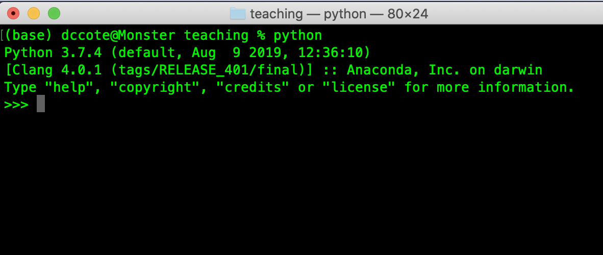
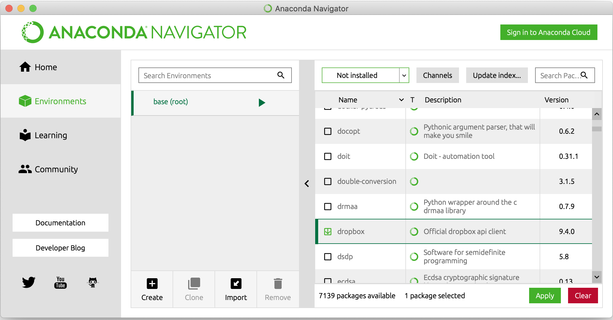
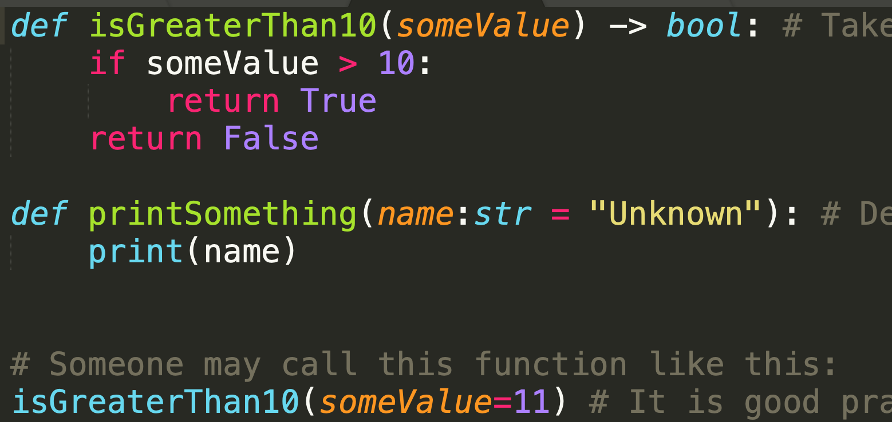
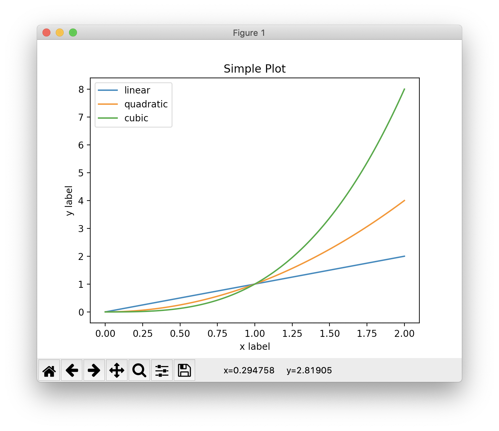

[TOC]


# Getting started in Python

This document is for non-expert programmer scientists, such as biologists. It will explain what Python is and will show you what you have to do to get started.

Python is a computer language. It has been popular with scientists because it is free, fast, flexible and has all the features expected from modern programming languages.

## It is free

Python is available on any platform (Windows, macOS, Linux and everything you can think of, including Raspberry PI) and well supported. It comes on Linux and macOS by default (2.7 as of 2019), but can still be manually installed side by side with the version that comes with your system without interference.

Partly because it is free, there exists many different ways to "get Python on your computer". The best solution is to use [Anaconda](http://www.anaconda.com/), which will install everything for you (include specific modules that are commonly used).

The language still evolves and newer versions are released every year.

## Fast

Python offers reasonable performance for intense numerical computations.  There are multiple modules that are very powerful and offer high performance computations, such as `numpy`, `scipy`, etc...

Because Python is an "interpreted language", it does not require a complicated set up with a compiler.  This means you type your program into a text file, then you "run it with Python". It is very straightforward, as opposed to other languages which are admittedly much higher performance (C, C++, Objective-C, Swift, C#, etc...) but more complicated for beginners.

## Flexible

At the heart of Python, you will find `modules`.  Typically, in a Python script, you will have a command a the beginning that imports the code from a module:

```python
import numpy
# More code after this
```

This allows people to package their code into a module, then distribute them through community-supported sites such as http://pipy.org. Anybody can create modules that can be used by others, and anybody can upload them on pypi.org, which has made Python a very dynamic language that becomes more powerful as people create new modules. Many modules come from Python itself (`math`, `os`, `sys`, etc...) but you can get modules on http://pypi.org for instance and many other places. 

As a comparison, Python modules are similar to MATLAB toolboxes that extend MATLAB.

## Modern language

Any task that is sufficiently complicated (image analysis, data analysis, etc...) will at some point require a strategy to hide the complexity of how it performs its job to make it manageable by others but also by the main programmer. A good modern computer language today is expected to support :

1. Object-oriented interface (i.e. classes)
2. Extendability (i.e. modules)
3. High performance numeric types (i.e. numpy and others)
4. Good interoperability with other languages
5. Good access to the Operating System facilities (network, files, etc...)
6. Good debugging, profiling and testing tools

Python offers all of that.

## Examples

1. Very good image analysis (`scipy`), image segmentation modules (`skimage`) exist and can be used by scientists.
2. Python is the language of choice at Google, and machine learning modules have been created (`TensorFlow`, `PyTorch`).
3. Python is the underlying language for scripting at Apple and can create windows and display dialogs


# Installing Python

The best option is to use [Anaconda](http://www.anaconda.com), which will install the latest Python version and many useful modules.  It makes managing Python on your platform simple. 

## Troubleshooting

It is fairly commong to end up with multiple versions of Python on one's computer. You may  install Python with Anaconda, or install it manually with other packages twice or even three times and end up with several copies.  On the command line, you will attempt to run Python with a given module but the module will not be available although you believe you have installed it already: this happens when the command-line uses a different version from the one you think you are using (say the system version versus Anaconda version). On macOS, you have the version from Apple (which cannot be removed), on many Linux versions you also have Python installed.

The solution is to either remove the redundant version of Python or adjust your command-line path appropriately.

# Basic programming

Before diving into Python, we need to at least survey the most important building blocks of any programming language: variables, arrays, and other types,  condition-statements, for-loops, while-loops, , functions (with arugments and return values), classes.  All languages have such structures, and it is  just a question of knowing the syntax for Python at this point.

## Statements

```python
# A statement is anything on a single line
a = 1
# Indentation is important: there are no {} or () in Python loops (see below)
```

## Types

```python
a = 1
type(a)
#prints <class 'int'>
a = 1.0
#prints <class 'float'>
a = True
#prints <class 'bool'>
a= (1,2)
#prints <class 'tuple'>
a = "Daniel"
#prints <class 'str'>
a = 'Daniel'
#prints <class 'str'>
a = [1,2,3]
#prints <class 'list'>
# and many others
```

## Variables

```python
# A comment appears after a '#'
a = 1 # This is an integer variable (can take any integer value)
b = 4.1 # This is a floating point variable (can take any floating point value)
isDone = True # A boolean value
name = 'Daniel' # This is a string of text
name = "Daniel" # Same thing
array = [4,5,6] # An ordered list of integers
array[0] # First element 4
array[2] # Last element 6
array[-1]# Also last element 6
otherArray = ["Daniel", "Cote","Ouchimama"] # An ordered list of strings
triplet = (1,2,3) # This is a triplet (called a tuple) made of three values
otherTriplet = (1.0, 2, "Daniel") # Triplet made of three values of different types
someRange = range(5) # Returns an array with 5 values, starting at 0 [0,1,2,3,4]
```

## If-statements

An `if-statement` will execute a block of indented code if a condition is true or another if a condition is false

```python
isDone = True

if isDone:
    print("Done")
else:
    print("Not done yet")
    
# You can also have if ... else if ... else if ... else ...
a = 5
if a < 0:
  print "Negative"
elif a == 0:
  print "Null"
else a > 0:
  print "Positive"
    
```

## For-loops

The `for-loop` will execute the indented code `n` times, given by the number of elements in the array.

```python
for index in [0,1,2,3]: # The variable index will take all values from the array
    print(index)        # Notice the print command is indented by 4-spaces
# This will print:
# 0
# 1
# 2
# 3

for i in range(4):  # The variable i (you can choose anything) will 
  									# take all values range(4)
    print(i)        # Notice the print command is indented by 4-spaces
# This will also print:
# 0
# 1
# 2
# 3
    
```

## While-loops

The `while-loop` will execute the indented code until a condition is not met anymore. 

```python
i = 0
while i < 4:
    print(i)
    i = i + 1 # Add 1 to i
    # Is i < 4? If yes, loop again, if not, leave while loop
    
isDone = False
while not isDone:
    # Do something
    isDone = computeStuffIncrementally() # Some function that may return True or False

```

## Functions

A function can be defined to simplify the code.  It accepts arguments that can be named, can have default values, and their type can be indicated. The way to call a function is to use the name of the function and name its arguments.

```python
def isGreaterThan10(someValue) -> bool: # Takes 1 argument (type is not known) returns 1 value (bool)
    if someValue > 10:
        return True
    return False

def printSomething(name:str = "Unknown"): # Default value is "Unknown", returns nothing
    print(name) 
  
  
# Someone may call this function like this:
isGreaterThan10(someValue=11) # It is good practice to name the argument 
                              # because it is readable
isGreaterThan10(11)           # You may also do that (but don't)
isGreaterThan10("Daniel")     # Runtime error because "Daniel" is not a number

printSomething(name="Daniel") # Will print Daniel
printSomething("Daniel")      # Will also print Daniel
printSomething()              # Will print Unknown
printSomething(name=4)        # Will print 4
```

## Classes

An object (or a class) keeps the data and the methods to operate on that data together. 

For instance, we can have a project where we need to manage a list of people.  A `Person` would be a useful class because it keeps everything together: first and last name, date of birth, gender, etc...  If need be, it can manipulate that data to return something useful (such as age from the date of birth or the full name by concatenating the first and last names together):

```python
class Person:
  	# An __init__ function is defined to initialize the object
		def __init__(firstName:str, lastName:str, dateOfBirthYYYYMMDD:(int, int, int), isMale:bool):
      	# self refers to "this object".  In this __init__ function,
        # self.firstName defines a variable that is included (i.e. kept) in Person
        # Hence, self.firstName is the variable firstName in the object Person,
        # but firstName (without self. in front) is the variable that was 
        # passed as an argument
        self.firstName = firstName
        self.lastName = lastName
        self.dateOfBirth = dateOfBirthYYYYMMDD
        self.isMale = isMale

    # Other functions can be defined at will
    def fullName() -> str:
        return self.firstName + " " +  self.lastName
    
    def gender() -> str:
        if self.isMale:
            return "Male"
        else:
            return "Female"
          
    def age() -> float:
      	# Compute age from today's date and date of birth
        # For now, returns 18
        return 18
      
      
# You could do this:
someone = Person(firstName = "Daniel", lastName="Côté", dateOfBirthYYYYMMDD=(1973,2,27), True)

# One calls the function of that object with the variable name.function() syntax:
print(someone.fullName()) # Will print Daniel Côté. Notice: variableName.function()
print(someone.age()) # Will print 29 because I am 29. Always will be.

someoneElse = Person(firstName = "Madeleine", lastName="Côté", dateOfBirthYYYYMMDD=(2007,4,1), False)

# You can treat objects like anything else: make lists, etc... use them in functions
group = [someone, someoneElse]


```

The ability to define a class is an important feature of a language: not all languages allow it. 

At this point, it is not important for you to know **how** to define classes or **what** is a good class design, but rather to know that they **can** be defined.  When using other modules, made by other people, you will likely encounter classes and you will need to learn how to use them. Being able to program in an object-oriented manner (i.e. how to design good classes) is a skill in itself that must be learned and practiced. It takes time to master.

# Python-specific programming

1. You can start a Python interpreter by typing `python` in your Powershell (Windows) or Terminal (macOS, Linux). You can then type individual statements.



3. In loops, if-statements, class definitions, **indentation** is critical. There are no parentheses to indicate the block of block, it must be indented right.
4. Many modules can be installed with Anaconda Navigator or pip with `pip install modulename`.



5. Use an appropriate text editor like [Sublime Text](http://www.sublime.com), which will highlight the variables and functions properly if the name of the file you are editing ends with `.py`.

   

# First program: plotting data

Let's start with a simple example: plotting data using `matplotlib`, a standard Python module to plot, visualize essentially anything scientifically relevant.

We start by importing the modules we will need:

```python
import numpy as np
import matplotlib.pyplot as plt
```

We use the syntax `import ... as ...` so that we can refer to functions from `numpy` with `np` instead of the longer, tedious `numpy`.  It is common to `import numpy as np`. 

We create two arrays, which are lists of floats. 

```python
x = np.linspace(0, 2, 100)
yLinear = x
yQuadratic = x**2
yCubic = x**3	
```


1. We use `np.linspace()` because `range(x)` will only create a list of integers, and we want loating point values [0.0, 0.1, 0.2 etc...]
2. `**` *means raised to the power of*
3. We can then create very easily a y variable that has the same values, the 2nd power of y and the 3rd power of y.  Note that this is thanks to `numpy`: you cannot simply take the power of a list of numbers, but `numpy` has created an *array of numbers*-class that offers this functionality.

Finally, we create our figure with its plots.

```python
fig = plt.figure()  # an empty figure with no axes
plt.plot(x, yLinear, label='linear')
plt.plot(x, yQuadratic, label='quadratic')
plt.plot(x, yCubic, label='cubic')
plt.xlabel('x label')
plt.ylabel('y label')
plt.title("Simple Plot")
plt.legend()
plt.savefig("MyFigure.tiff",dpi=600)
plt.savefig("MyFigure.pdf")
plt.show()
```

The whole script is available below and can be [downloaded](./GUIDE-Python.assets/teachingMatplotlib.py). You run it with `python teachingMatplotlib.py`

```python
# name this: teachingMatplotlib.py
import numpy as np
import matplotlib.pyplot as plt

x = np.linspace(0, 2, 100)   # An array of 100 numbers between 0 and 2
yLinear = x       # y = x
yQuadratic = x**2 # y = x*x
yCubic = x**3     # y = x*x*x

fig = plt.figure()  # an empty figure with no axes
plt.plot(x, yLinear, label='linear') # Create first curve, with a label
plt.plot(x, yQuadratic, label='quadratic')
plt.plot(x, yCubic, label='cubic')
plt.xlabel('x label')
plt.ylabel('y label')
plt.title("Simple Plot")
plt.legend() # Show legend
plt.savefig("MyFigure.tiff",dpi=600) # Save the figure as high res tiff
plt.savefig("MyFigure.pdf") # Save as a PDF, which is always high res
plt.show()
```

You should obtain the following window:



## Note

1. If you have errors, check the syntax.  If it complains about `matplotlib` or `numpy`, they may not be installed with your version of Python because you did not follow my instructions (did you?) to use Anaconda.

2. Most importantly, you need to look up the documentation for `matplotlib`.  Read the [excellent tutorial](https://matplotlib.org/tutorials/index.html) to learn more. Much more.

3. Notice that you can zoom and pan around the window with the buttons at the bottom left.  Click the home button to go back to a full view.  You can also save, however, the resolution will be that of the screen, which can only be qualified as "sucky".  Always save your figures directly in your script using a PDF extension, that is what the lines do:

4. ```python
   plt.savefig("MyFigure.tiff",dpi=600) # Save the figure as high res tiff
   plt.savefig("MyFigure.pdf") # Save as a PDF, which is always high res
   ```

   


# Second program: showing an image

To show an image, we use the `PIL` module (Python Imaging Library).

```python
import matplotlib.pyplot as plt
import numpy as np
import PIL

image = PIL.Image.open("MyFigure.tiff") # Load an image from current directory
image.show() # Show using the operating system facility

imageAsArray = np.array(image) # You can also show the image using plot 
plt.imshow(imageAsArray)       # but the image will have axes 
plt.show()                     
```


#  Third program: modifying an image

