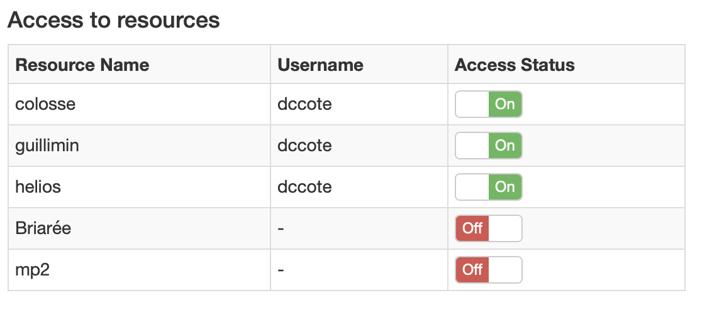

# Access *Calcul Quebec* to run Jupyter Notebooks on *Helios* GPU

This procedure will get you a working Jupyter Notebook logged on CalculQuebec's *Helios* GPU.

 

## Prerequisites

1. Daniel Côté's ComputeCanada Sponsor ID. 

 

## Procedure

1. [**Create a ComputeCanada Account**](https://ccdb.computecanada.ca/account_application)

   You will need the sponsor ID from Daniel Côté. Now wait/ask for approval from Daniel. 

2. **Apply for a CalculQuebec Server Account** 

   1. Login to your ComputeCanada Account and go to *Account -> Apply for a consortium account* to create an account on a calculation server, and apply for CalculQuebec. Make sure to check *Helios* device at least.
2. If you want to request access to servers later, login to [portail.calculquebec.ca](http://portail.calculquebec.ca) and go to My Account.
   3. There you can request access to specific servers:
      
   
3. **Wait around 30 minutes for approval.**

4. **Log in to Helios server with SSH**

   You need to connect to *Helios* by SSH at least once to get access to a Jupyter Notebook. 

   **Linux/Mac**

   - Open terminal and type in

     ```
     ssh yourUsername@helios.calculquebec.ca
     ```

   **Windows**

   - Download PuTTY
   - Log into server helios.calculquebec.ca on port 22

   Detailed procedure [written here](https://wiki.calculquebec.ca/w/Se_connecter_et_transf%C3%A9rer_des_fichiers/en). The website also shows how to transfer data to your server. 

5. [**Open your Jupyter Notebook**](https://jupyter.calculquebec.ca/hub/home)

   Login with your CalculQuebec account. Check *Requires a GPU* to use *Helios*. 

   For further instructions on how to install packages and kernels (python environnements) [^1] , follow the [CQ Jupyter Wiki](https://wiki.calculquebec.ca/w/JupyterHub). 

   [^1]: Make sure you add the desired module (or python version) on the software tab in the jupyter notebook before following the instructions on how to add a new kernel. 


## Anaconda3 installation

You may want to install Anaconda3 to have a complete, manageable environment. Instructions are [available](https://www.digitalocean.com/community/tutorials/how-to-install-anaconda-on-ubuntu-18-04-quickstart).


## Clone a GitHub repository

*N.B. : Do not leave any `<` `>` characters.*

1. **Log into Helios server with SSH (last step 4)**

   Use this connected terminal for the following steps.

2. **Clone repository**

  If `git clone` with https (option 1) outputs a connection error, try option 2. 

  **OPTION 1 : Github https login** (for private repo ?)

  ```
  git clone https://github.com/<USER>/<REPO>.git
  cd <REPO>
  ```

  ​	Remember credentials

  ```
  git config credential.helper store 
  ```

  OPTION 2 : Github ssh key

  ```
  git clone git://github.com/<USER>/<REPO>.git
  cd <REPO>
  git config --global user.name "<username>"
  git config --global user.email <your@email.ca>
  git remote add origin git@github.com:<USER>/<REPO>.git
  ```

  ​	Create SSH access key:

  ```
  eval $(ssh-agent -s)
  ssh-keygen -t rsa -b 4096 -C "<your@email.ca>"
  ```

  ​	*Press enter for default key file location.*

  ```
  ssh-add ~/.ssh/id_rsa
  ```

  ​	Copy SSH key to your GitHub Account

  ```
  clip < ~/.ssh/id_rsa.pub
  ```

  > *If it does not work, find the hidden file and copy its content.*

  ​	Then go to GitHub Website -> Account Settings -> SSH -> Add New SSH and paste the key.

  ​	Come back to your terminal and type in

  ```
  ssh-add -l
  ```

  ​	Verify connection with 

  ```
  ssh -vT git@github.com
  ```


3. **Create .gitignore file (optional)**

  ```
  touch .gitignore
  vim .gitignore
  ```

	Press <a> to edit the file. Then press <escape>, type `:wq`  and press <enter> to save file.

4. **Commit and push changes:**

  ```
  git add .
  git commit -m "Initial commit"
  git push -u origin master
  ```

