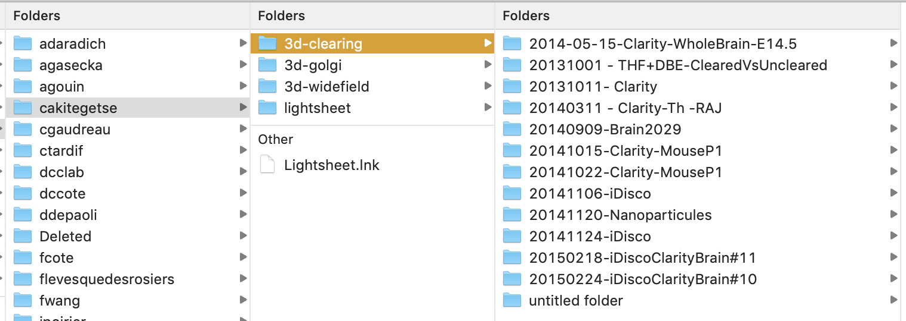

# Labdata: DCCLab data repository

L'archivage des données n'est pas seulement utile, il est essentiel pour un laboratoire sérieux. Dans le but de s'assurer de la pérennité des données, nous devons avoir une convention pour sauvegarder nos données sur nos disques (laboratoire, personnel, portable, etc...). En ayant une nomenclature simple, n'importe qui pourra accéder aux données facilement et nous pourrons les archiver de façon systématique. Donc, Caféine aura la totalité des données qui proviendront des multiples ordinateurs du groupes, mais pour ce faire et éviter le fouilli total, voici la nomenclature à suivre.

**Notez: ce n'est pas une recommandation, mais bien une méthode obligatoire pour tous les membres du groupe. Vous devez copier vos données à chaque jour sur labdata.**

Caféine contient les archives de tous, dans un dossier qui se lit comme suit:

`/labdata/username/project/YYYYMMDD*/`

Donc: votre username, le nom du projets (seulement les noms valides, voir ci-dessous) et la date (Année, Mois et Jour) et ensuite ce que vous voulez. Voici un example:

Ces données sont accessibles **universellement** et **éternellement,** **c'est à dire qu'une fois les données sur caféine, on ne peut changer leur nom ou leur emplacement.** Considérez ces données comme "des données de cahiers de laboratoire", donc on n'efface rien.

Pour ce faire, vous devez utiliser la structure suivante:

1. Sur tous les ordinateurs (portable, desktop, labo), il doit y avoir un répertoire "**labdata**" (en minuscule) dans lequel toutes les données sont sauvegardées. Vous pouvez le mettre où vous voulez.
2. La structure est ensuite "le nom" de l'usager **en lettres minuscules** (pour vos portables et ordinateurs personnel, vous pouvez sauter cette etape, mais pour les ordinateurs de laboratoire, indiquez votre nom). **Vous devez utiliser le même orthographe tout le temps** Voir ci-dessous pour les nombns de projets.
3. Ensuite, vos projets, **en lettres minuscules**. Encore une fois, **vous devez utiliser le même orthographe tout le temps.** Il y a peu de projets dans le groupe. Il y a peut être déjà un ou des projets sous votre nom d'usager, avant de créer un projet, vous devez regarder sur [cette page du wiki ](http://cafeine.crulrg.ulaval.ca/groups/cote/wiki/7642b/Noms_et_projets_pour_larchivage_des_donnees.html)ou dans votre section sur caféine à [http://cafeine.crulrg.ulaval.ca/labdata/](http://cafeine.crulrg.ulaval.ca/labdata/(votrenom)/)
4. Finalement, lorsque vous faites une expériences, ou encore une analyse, vous devez sauvegarder dans un dossier dont le nom commence par la date en format YYYYMMDD ensuite vous pouvez ajouter ce que vous voulez (comme par exemple: 20101029-WavelengthSwept_Test). Vous devez éviter les accents et les /, si possible les espaces (pour éviter les URL compliqués).
5. Ensuite, vous pouvez nommer vos fichiers et refaire des dossiers comme il est approprié pour ce que vous faites.
6. Négociable, mais souhaitable: vous devriez avoir un README.txt qui indique ce que le dossier contient.

Ensuite, vous devez "synchroniser" vos ordinateurs avec caféine. Notez:

1. La synchronisation doit se faire environ une fois par jour (avant de partir le soir ou en arrivant le matin).
2. Une fois cette synchronisation faite, vous ne pouvez plus renommer de fichiers dans votre labdata. Si vous voulez le faire, cela doit être fait avant la synchronisation.
3. Il existe des outils pour faire cette synchronisation facilement et rapidement. rsync existe pour Windows, Mac OS X et Unix. **Une page WIki** [**sera créée**](http://cafeine.crulrg.ulaval.ca/groups/cote/wiki/8c93a/rsync_pour_tous.html) **pour expliquer l'installation de rsync pour chacune des plateformes [Volontaire SVP]**.

Dans votre cahier de laboratoire, vous pouvez faire un lien faire ces données, qui se retrouveront sur caféine. Vous pourriez écrire par exemple, "données dans labdata à ws-cars/20101029-Test/" sans mettre votre nom puisque votre cahier vous appartient mais vous devez mettre le projet et le dossier daté.

# Projets

| Nom de dossier | Description |
| ---- | ---- |
| 3d | Imagerie 3D grand volume (cakitegetse) |
| 6-color | Modification du microscope video pour donner 6-couleur en meme temps  |
| autofluo | Autofluorescence des tissus |
| axons | Projets utilisant les souris Thy1-YFP pour la caracterisation des axones |
| b-cars | Projet broadband CARS avec une source provenant du continuum (sbegin) |
| beautiful | Les belles images du groupe.  Vous pouvez recopier les votres dans ce repertoire |
| bone-ablation | Projet d'ablation des os avec les lasers amplifies |
| brainstem | Projet d'imagerie du brainstem avec David Kleinfeld |
| cam | Projet d'imagerie des CAM (Cellular Adhesion Molecules) dans les vaisseaux |
| cars | Imagerie CARS, test, initiatives personnelles, etc… GENERAL. |
| clearing | Tout projet impliquant l'imagerie avec les techniques de clearing |
| cs-cars | CARS correlation spectroscopie pour la detection de l'eau deutere |
| dbs | Projet de Deep Brain Stimulation avec les sondes fibrees (CARS, reflectance ou autre) |
| eae | Tous les projets de scleroses |
| fiber-probes | Fabrication ou caracterisation des sondes fibrees de tout genre |
| functional | Projets d'imagerie fonctionnel dans les animaux vivants |
| functional-uncaging | Projet d'imagerie dans les epines avec l'uncaging de molecules excitatrice |
| grintech | Projet avec l'endoscope de GRINTech (toute modalite) |
| hres-cars | Projet d'hyper-resolution CARS  |
| infiltration | Projet d'infiltration cellulaire dans la moelle epiniere en EAE (Steve Lacroix) |
| invivobeads | Projet de detection de billes fluorescentes magnetiques InVivo (Armen) |
| inflammation | Projet d'inflammation cellulaire dans la moelle epiniere en EAE |
| iphoton | Amelioration de iPhoton |
| lightsheet | Imagerie par lightsheet Bessel |
| microglia | Imagerie de la microglie dans la moelle (son infiltration) |
| microglialmotility | Imagerie dynamique de la microglie (son activite) |
| mneptune | Imagerie de mNeptune (proteine fluorescente rouge) |
| monocytes | Infiltration des monocytes dans la moelle epiniere |
| mri-gratio | Comparaison du g-ratio mesure par MRI et par CARS (Julien Cohen Adad) |
| oblique | Imagerie par illumination ou detection oblique (Jerome Mertz) |
| optogenetics |  |
| pd-cars | Polarization-dependent CARS |
| fixation-morphometry | Validation des protocoles de perfusion et leur effets sur la morphometrie de la myeline  |
| ppix | Fluorescence du PPIX en epilepsie |
| raman | Spectroscopie Raman spontanee |
| rfp | Red fluorescent protein comparison (Karen Lypka) |
| rms | Imagerie de Rostral Migratiory Stream (Armen Saghatelyan) |
| rotaryprobe | Imagerie par la sonde rotative panoramique |
| sciaticnerve | Imagerie des lesions du nerf sciatique par crusj injury |
| serotonin | Imagerie de la fluorescence de la serotonine |
| spinalcord | Imagerie generale de la moelle epiniere |
| sted | Imagerie par STED |
| suicide | Imagerie du corps calleux dans les cas de suicides et d'abus |
| summerschool | Neuropthonics SummerSchool |
| tf-dh |  |
| unassigned | Junk  |
| vasculature | Imagerie de la vasculature et de se permeabilite |
| vss | Voltage sensitive sensing |
| w-cars | Water-CARS, CARS de l'eau |
| window | Imagerie longitudinal de la moelle avec une fenetre spinale |
| ws-cars | Wavelength-swept CARS (sbegin) |
| zebrafish | Imagerie calcique du poisson zèbre |
