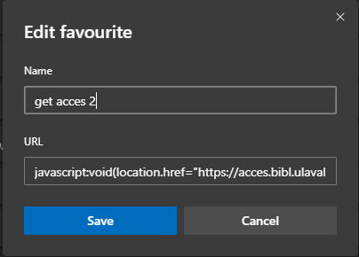
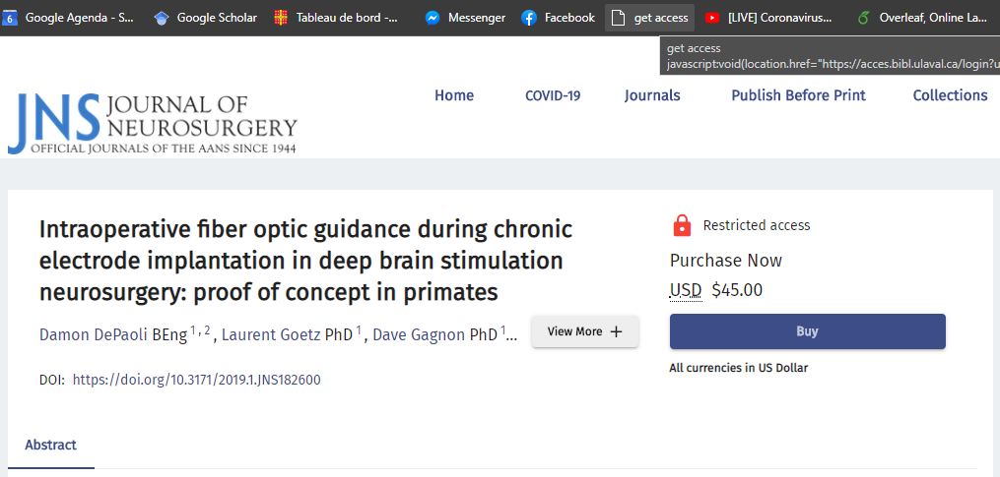
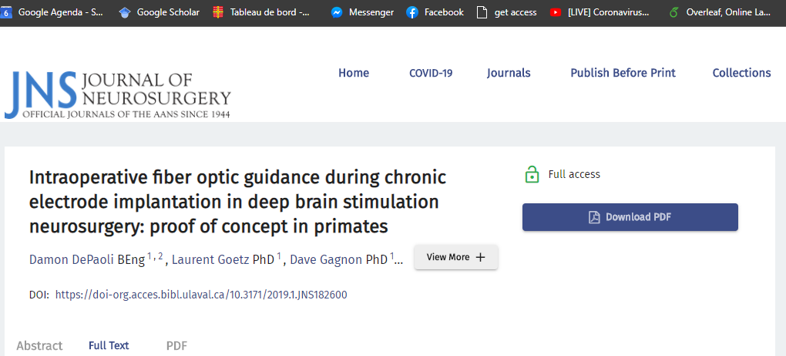

# HOWTO - Access virtually all articles

Often, one must look for papers and articles on the web. Here's a simple explanation on how to access easily *virtually* all the articles that one would want. **This will work on almost any article bank/journal.** One exception is the *IEEEjournal*.

1. In your browser, create a new *favorite* in your quick access tool bar.
2. Name this *favorite* something easy to understand and recognize: `getArticleAccess`
3. Enter the following `javascript` code as the URL:
   `javascript:void(location.href="https://acces.bibl.ulaval.ca/login?url="+location.href)`
4. Once one an article bank webpage or a journal's article page, click on your new favorite.
5. Log into *monPortail*.
6. Download your article's PDF.

Here's an example to help you visualize:

