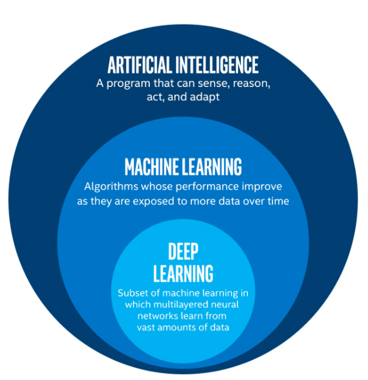
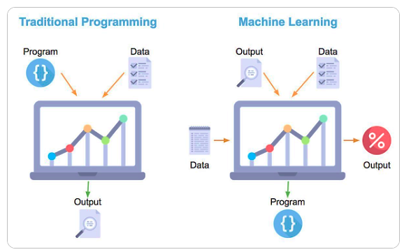
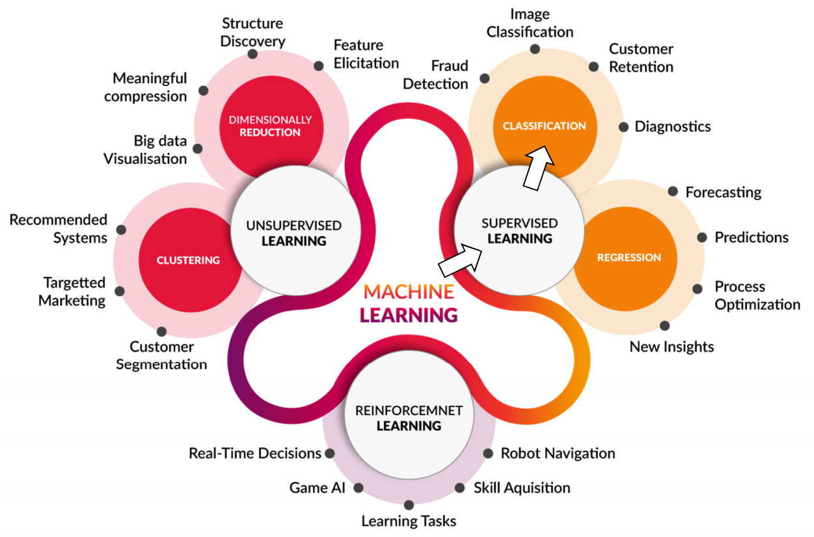
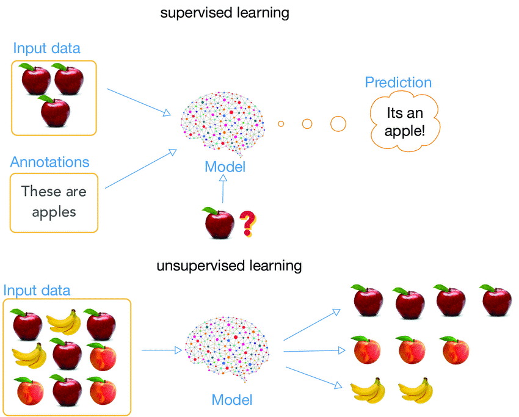
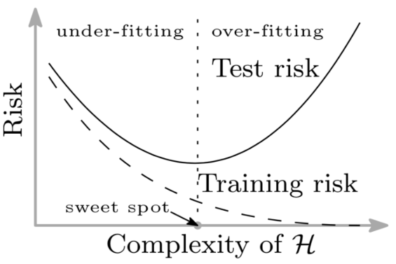
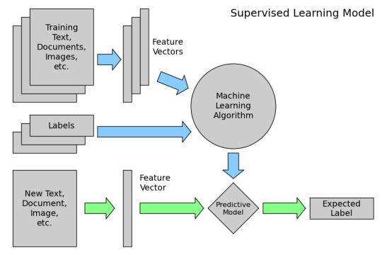

# Machine Learning

The goal of this document is to give an introduction to the general concepts and theory around Machine Learning and its applications. 

 

----

### Table Of Content

1. [Introduction](#introduction)
   1. [Understanding the nomenclature](#nomenclature)
   2. [Branches of Machine Learning](#branches)
2. [ML Algorithms and Components](#algorithms)
   1. [Algorithms and parameters](#algorithms)
   2. [Loss Function and Error](#error)
   3. [Training, validation and test](#training)
3. [Neural Networks](#NN)
   1. [Perceptron](#perceptron)
   2. [Neural Network](#multi)
4. [Deep Learning](#DL)
5. [Applications](#applications)
-----

 

## 1. Introduction <a name="introduction"></a>

### Understanding the nomenclature <a name="nomenclature"></a>

<p align="center"></p>
 **Artificial intelligence** is used to describe machines that mimic "cognitive" functions that humans associate with the human mind, such as "learning" and "problem solving" [1]. This general domain contains image processing, cognitive science, machine learning, neural networks and much more. **Machine learning** on its end is a more specific subject of AI that nowadays encapsulates almost all AI research topics. Its core idea is that the computer does not just use a pre-written algorithm, but learns how to solve the problem itself. 

&nbsp;

> *Machine Learning is a field of study that gives computers the ability to learn without being explicitly programmed.* - **Arthur Samuel** (1959)

Machine learning started flourishing with the arrival of the big data, the increase in computation power (GPU) and the development of new machine learning algorithms. 

#### Traditional programming VS Machine Learning
<p align="center"></p>
In traditional programming you hard code the behavior of the program. In machine learning, you leave a lot of that to the machine to learn from the data iteratively. ML is used in the case when traditional programming strategy falls behind and it is not enough to fully implement a certain task. This is usually the case when the amount of inputs is too high, as with forecasts, image processing, speech recognition, etc.

### Branches of Machine Learning <a name="branches"></a>

<p align="center"></p>
**Reinforcement learning** is about optimizing a decision making policy with experiences and rewards. It focuses on finding a balance between exploration of territory and exploitation of current knowledge. 

*[Example](https://pytorch.org/tutorials/intermediate/reinforcement_q_learning.html): the agent has to decide between two actions - moving the cart left or right - so that the pole attached to it stays upright*

<p align="center"></p>
**Supervised learning** tries to learn a function that maps an input to an output based on a learning process over training examples. In supervised learning, each example is a *pair* consisting of an input object and a desired output value (labels). This topic divides into classification (hottest subject in machine learning) and regression (forecasts, predictions). 

<p align="center"></p>
**Unsupervised learning** helps to find unknown patterns in an input dataset without pre-existing labels to regroup inputs into clusters, reduce the number of dimensions or simplify a vast input into a few principle components. The main methods used in unsupervised learning are principal component and cluster analysis. 

<p align="center"></p>
In image classification, supervised learning will extract features from the input and learn to correctly link these features to the input label. Unsupervised learning with extract features from the inputs and only try to regroup them into *different* clusters.

<p align="center"></p>
----

 

## 2. ML Algorithms and Components <a name="components"></a>

### Algorithms and parameters <a name="algorithms"></a>
There is a wide range of algorithms available and none of them works best for all problems. Sometimes called a predictor, the algorithm will usually learn to optimize a prediction function `h` with parameters `θ` to optimize during training (if **parametric**). Here is a visual list of the most popular ones:
<p align="center"></p>
It is important to note that not all algorithms are parametric. Like the simple *k-nearest neighbors* algorithm that is intentiated with a chosen number of neighbors to look at in order to infer the value of a new input. In this case, `k` is called an hyperparameter. In machine learning, an **hyperparameter** is a parameter whose value is set before the learning process begins, while parameters are defined during training. In the coding process, hyperparameters are passed in as arguments to the constructor of the model class. 

Some examples of hyperparameters include loss function, regularization, learning rate, number of leaves in a tree, number of hidden layers in a neural network, number of clusters in clustering techniques... 

#### Capacity
An important property of a machine learning algorithm is its **capacity**. The capacity of a model describes how complex a relationship it can model, although the term is loosely defined and cannot really be quantified. Conceptually, capacity represents the number of functions that a machine learning model can select as a possible solution. A general rule is that the more parameters a model has, the higher is its capacity. A low capacity model faced with a complex task will tend to underfit (high training error). On the other end, a high capacity model applied to a simple task might overfit (low training error, but high validation and test error). A model will often include a regularization function that will increase the loss with the increase in complexity to limit overfitting. 
<p align="center"></p>


### Loss Function and Error <a name="error"></a>

The empiric error `R_emp` corresponds to the mean of the loss calculated at each point with a chosen loss function `L(y, ŷ)` (usually either absolute error `|y-ŷ|` or quadratic error in regression, or cross entropy in classification) where `ŷ` is our prediction given by our predictor `h` with parameters `θ`. The predictor in our case is the neural network, while the parameters correspond to the weigths of its hidden layers. These parameters are optimized during training. 
<p align="center"></p>
We could go deep into machine learning components to better understand not only how they work but mainly how one can work *well* (which as been the source of development for new ML algorithms). The list can be exhausting and a little math-oriented, so we will leave that aside for now since we want to jump into deep learning for image analysis. For those interested in learning more about machine learning components, I would suggest following a simple notebook example taken from an ML course: `MLComponentsAndAlgorithms.ipynb`.

### Training, validation and test <a name="training"></a>
The **training** procedure involves providing an ML algorithm with training data to learn from. For each sample, the model gives a prediction, calculates its error and the gradient. It then update its parameters directly (or through back-propagation) following a gradient descent. Usually you cannot load the whole training data at once so we feed the data to the model in **batches**. Once the model has seen all the data, we have completed what is called an **epoch** (or iteration). This procedure will usually have to be carried multiple times for succesful training, hence multiple epochs. 
<p align="center"></p>
The dataset is always **split** into training and test (usually around 80% training ratio). The **test** set is put on hold for final testing. Meanwhile during the training, a part of the training set is used for **validation** in-between epochs to measure overfitting. Validation set is usually obtained by taking 20% of the training data (or through a cross-validation technique). 
<p align="center"></p>
Training and validation errors give a **biased** approximation of the risk of the model, while the test error gives an approximation of the risk that is not biased. 


## 3. Neural Networks <a name="NN"></a>

After all the subjects we presented, we will focus our attention on supervised learning for classification, which is clearly the subject of interest for data analysis in science. To address the problem of classification, we will discuss two popular machine learning algorithms (*predictors*) suited for the task : the "simple" neural networks and the deep learning approach (mainly CNN). 

*An interesting and exhausting list of all the popular machine learning algorithms and predictors is also available [here](https://machinelearningmastery.com/a-tour-of-machine-learning-algorithms/).*

### Single-layer NN (or Perceptron) <a name="perceptron"></a>

The simplest neural network format is called a Perceptron and consists of a single input layer connected to their corresponding weights. A weighted sum is then calculated and fed into a step function. This *linear binary classifier* can be used to say whether or not an input belongs to some specific class. We can generally say that a perceptron is a single-layer neural network. 

<p align="center"></p>
##### Code example `perceptron.py` 

[Simple python perceptron from Thomas Countz](https://medium.com/@thomascountz/19-line-line-by-line-python-perceptron-b6f113b161f3)

```python
import numpy as np

class Perceptron(object):

    def __init__(self, no_of_inputs, threshold=100, learning_rate=0.01):
        self.threshold = threshold
        self.learning_rate = learning_rate
        self.weights = np.zeros(no_of_inputs + 1)
           
    def predict(self, inputs):
        summation = np.dot(inputs, self.weights[1:]) + self.weights[0]
        if summation > 0:
          activation = 1
        else:
          activation = 0            
        return activation

    def train(self, training_inputs, labels):
        for _ in range(self.threshold):
            for inputs, label in zip(training_inputs, labels):
                prediction = self.predict(inputs)
                self.weights[1:] += self.learning_rate * (label - prediction) * inputs
                self.weights[0] += self.learning_rate * (label - prediction)
                
```

### Multi-layer NN  <a name="multi"></a>

<p align="center"></p>
```python
""" Code example of a multi-layer neural network """

# TODO

# maybe try to use the same case-study to then compare [Perceptron: nope since its binary...], NN, CNN, optimized CNN...
```

----


## 4. Deep Learning <a name="DL"></a>

  

----


## 5. Applications <a name="applications"></a>

- [ ] talk about different data types and corresponding model or ML algorithms. talk about data cleaning and preparation ? : ref to HOWTO-ML
- [ ] talk about examples ? alphaGo, self driving cars, image and speech recognition, forecast


#### References

[1] [Russell, Stuart J.](https://en.wikipedia.org/wiki/Stuart_J._Russell); [Norvig, Peter](https://en.wikipedia.org/wiki/Peter_Norvig) (2009). *Artificial Intelligence: A Modern Approach* (3rd ed.).


-----

----------

###### Scratch

-----

----

- Neural networks: perceptron, feature extraction, loss function, activation, back propagation
- Discuss the different DL architectures specfific for different kinds of task (**CNN** for images (UNet for semantic), LSTM, )

A good way to better understand supervised learning is to jump into the inner workings of its model: in this case, a "simple" fully-connected neural network. 


#### The basis for supervised learning

1. Data collection
2. Data preparation
3. **Model choice and training**
4. Model evaluation
5. Optimisation

<p align="center"></p>
###### todo

https://en.wikipedia.org/wiki/Supervised_learning#Algorithm_choice , see dimensionality reduction.

