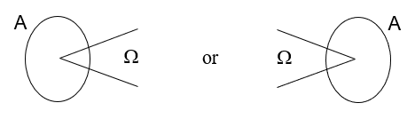
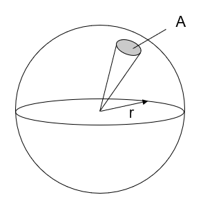
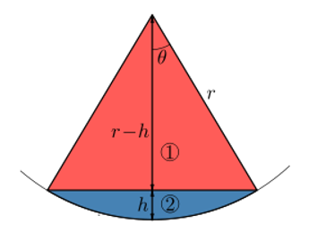
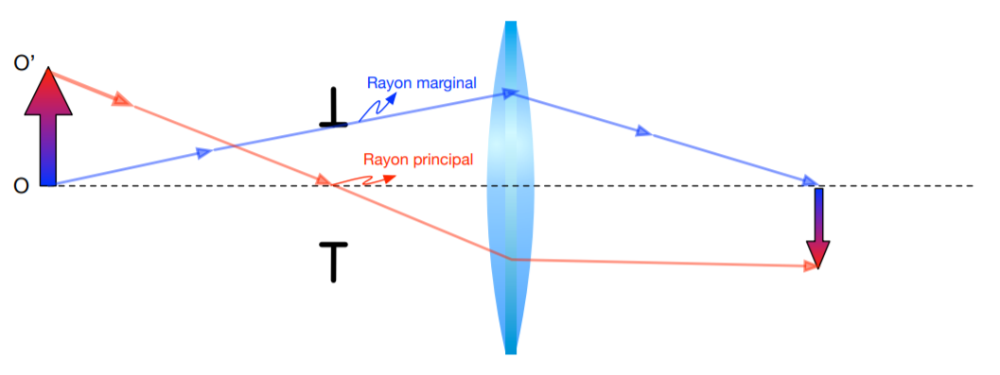
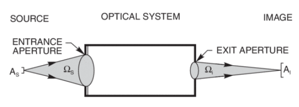
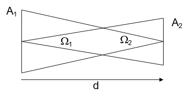
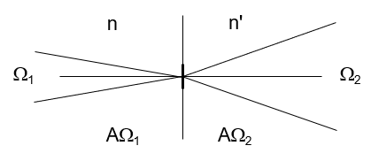
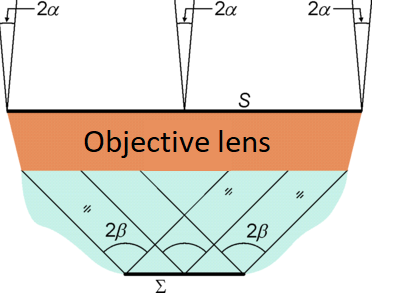
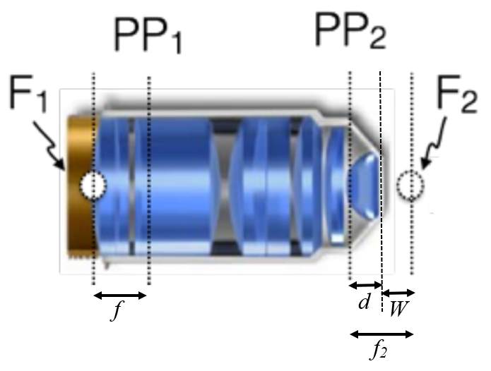
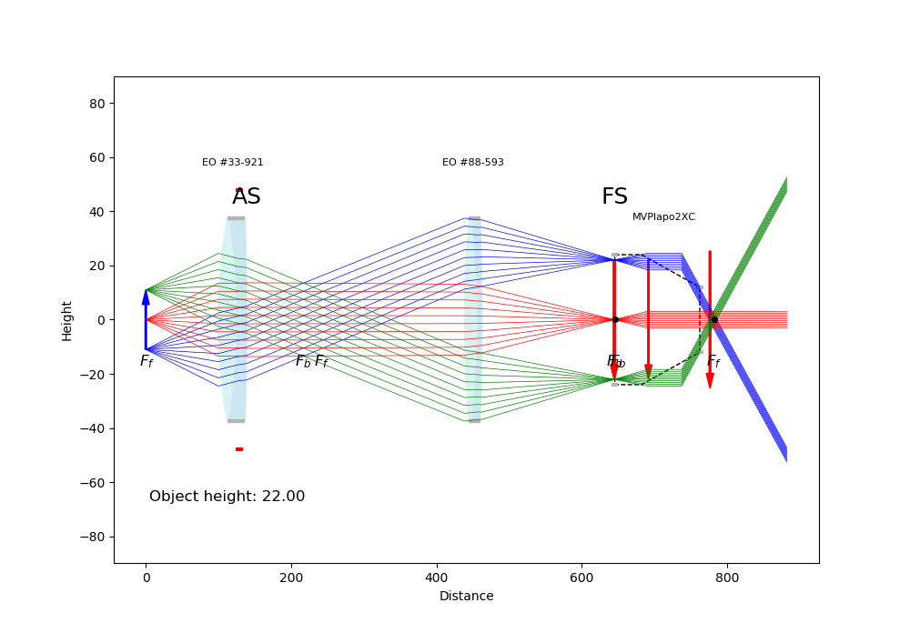

# Etendue

The goal of this document is to introduce the concept of etendue and to give some examples to clearly understand how to use it in different optical systems.

## Introduction

Etendue is a property of light in an optical system which characterizes how "spread out" the light is in area and angle. Other terms used for this property are geometrical extent (G), optical extent and throughput. The etendue never decreases and it remains constant in an ideal optical system (where optical power is conserved), just like the optical invariant. In an aberration free optical system which has no internal apertures that limit the beam (optical power conserved), etendue or geometrical extent (G) is defined as
$$
G = n^2A\Omega
$$
where *n* is the index of refraction of the medium, *A* is the cross-sectional area (normal to the direction of the propagation) and $\Omega$ is the solid angle that confines light crossing (or emitted from) the area (see figure below). 

_____________

## Solid angle

The definition of a solid angle $\Omega$ isn't trivial and a quick explanation of this concept is necessary.  The
solid angle equals the surface area of the unit sphere that is subtended by a surface relative to a point at the center of the unit sphere. It is a measure of how big something appears and it is a 2-dimensional angle in a 3-dimensional space. Just like a planar angle in radians is the ratio of the length of a circular arc to its radius ($\theta=\frac{L}{r}$), a solid angle in steradians is defined as 
$$
\Omega = \frac{A}{r^2}
$$
where *A* is the spherical surface area and *r* is the radius of the sphere. Therefore, there are $4\pi$ steradians in a full sphere.

We shall now calculate the solid angle of a cone with apex angle $2\theta$ and with its apex at the apex of the solid angle. 

Considering a spherical cap, we get
$$
\Omega = 4\pi\sin^2\left(\frac{\theta}{2}\right)
$$
and for a right circular cone, we find
$$
\Omega = \pi\sin^2\theta\approx\pi\theta^2.
$$

_________

## Relation to the Lagrange invariant

For small angle $\theta$ (paraxial approximation) and with the assumption that object, image and pupils are perpendicular to the optical axis, we can relate etendue to the Lagrange invariant. The beam of light is assume to have a conical shape.

**In an image or object plane :** 
$$
G=n^2A\Omega=n^2(\pi y_c^2)(\pi\theta_m^2)=\pi^2n^2y_c^2\theta_m^2=\pi^2Ж^2
$$
where $y_c$ is the chief ray height, $\theta_m$ is the marginal ray angle and $Ж=ny_c\theta_m$ is the Lagrange invariant in the object or image planes (see figure above). 

**In a pupil plane : **
$$
G=n^2A\Omega=n^2(\pi y_m^2)(\pi\theta_c^2)=\pi^2n^2y_m^2\theta_c^2=\pi^2Ж^2
$$
where $y_m$ is the marginal ray height, $\theta_c$ is the chief ray angle and $Ж=ny_m\theta_c$ is the Lagrange invariant in the pupil plane.

**In both cases**, $G=\pi^2Ж^2$. In fact, etendue is proportional to the square of the Lagrange invariant. The square is simply due to the fact that etendue involves areas whereas the Lagrange invariant involves linear measures.

_______

## Application examples

### 4f optical system

A more useful way of using this concept in practice is comparing the beam etendue at two planes. In this example, we choose the source and the image planes and we assume that the refractive index is 1. Therefore, we can write
$$
A_s\Omega_s = A_i\Omega_i
$$
where $A_s$ is the source area, $\Omega_s$ is the solid angle subtended at the source by the entrance aperture of the optical system, $A_i$ is the image area and $\Omega_i$ is the solid angle subtended at the image by the exit aperture (see figure below).

If the optical system is a 4f system with a magnification $\mathcal{M}$ and source has a radius $r_s$ and a numerical aperture NA$_s$, we have
$$
(\pi r_s^2)(\pi\sin^2\theta_{s}) = (\pi r_i^2)(\pi\sin^2\theta_{i})
$$
 where $r_i$ is the image radius and $\theta_s$ and $\theta_i$ are the maximum half-angle of the source and image conical beam, respectively. We know that with $n=1$, NA$=\sin\theta_{max} \approx \theta_{max}$ so the equation becomes 
$$
\quad r_s^2\theta_s^2 = r_i^2\theta_i^2 \\
\begin{alignat}{0}
&\Rightarrow \quad r_s\theta_s = r_i\theta_i \\
&\Rightarrow r_s\text{NA}_s = r_i\text{NA}_i \\
&\Rightarrow r_s\text{NA}_s = \mathcal{M}r_s\text{NA}_i \\
&\Rightarrow \quad \text{NA}_i = \frac{\text{NA}_s}{\mathcal{M}}
\end{alignat}
$$
We note that the second line is simply the optical invariant, which corresponds to what was explained in the previous section.

### Free space

In free space (in a medium with $n=1$), the conservation of etendue is simple to prove.  With the assumptions that $d >> r_1$ and $d >> r_2$, we have
$$
\Omega_1 = \pi\sin^2\theta_1 = \pi\left(\frac{r_2}{\sqrt{r_2^2 + d^2}}\right)^2 =  \pi\frac{r_2^2}{r_2^2 + d^2} \approx \pi\frac{r_2^2}{d^2} \\ \Rightarrow d^2 = \frac{\pi r_2^2}{\Omega_1}\\
\Omega_2 = \pi\sin^2\theta_2 = \pi\left(\frac{r_1}{\sqrt{r_1^2 + d^2}}\right)^2 =  \pi\frac{r_1^2}{r_1^2 + d^2} \approx \pi\frac{r_1^2}{d^2} \\ \Rightarrow d^2 = \frac{\pi r_1^2}{\Omega_2} \\
$$
We are now ready to prove the conservation of etendue in free space for circular cross-sectional areas.
$$
d^2 = \frac{\pi r_2^2}{\Omega_1} = \frac{\pi r_1^2}{\Omega_2} \\ \Rightarrow \pi r_2^2\Omega_2 = \pi r_1^2\Omega_1
\\ \Rightarrow A_2\Omega_2 = A_1\Omega_1
$$
A complete proof for a general area shape can be found [here](https://en.wikipedia.org/wiki/Etendue).

### Refractions and reflections

Etendue is also conserved in refractions and reflections, but the refractive index must be taken into account. In fact, the conservation of etendue is given by
$$
n_1^2A_1\Omega_1 = n_2^2A_2\Omega_2
$$

### Objective lens and field of view (FoV)

In this example, we want to determine the best way to illuminate a specimen using a specific objective lens and a 4f optical system. First, Köhler illumination is set up by conjugating the source at the back aperture of the objective lens. Then, to illuminate evenly all the field of view, the back aperture of the objective lens must be filled and the entrance angle has to be large enough to satisfy the optical invariant or etendue at the specimen.

Suppose we have an objective lens with a numerical aperture $\text{NA} = n\sin\beta$ (see figure below), a field number $FN$, a magnification $\mathcal{M}$ and a focal length $f$.  The first medium is air ($n=1$) and the medium between the objective and the specimen has a refractive index $n$ . What is the minimum angle $\alpha$ that can satisfy the etendue needed at the specimen?

**With etendue :**

Etendue conservation gives us 
$$
S\Omega_1 = n^2\Sigma\Omega_2
$$
and we know that
$$
S = \frac{\pi D_{EP}^2}{4} \\
\Omega_1 = \pi\sin^2\alpha \\
\Sigma = \frac{\pi*FoV^2}{4} \\
\Omega_2 = \pi\sin^2\beta
$$
so the equation becomes
$$
\quad \quad D_{EP}\sin{\alpha} = n\sin\beta*FoV \\
\Rightarrow D_{EP}\sin{\alpha} = \text{NA}*FoV.
$$
The diameter of the entrance pupil is given by
$$
D_{EP} = 2f\text{NA}
$$
and the field of view by
$$
\text{Field of view}~(FoV) = \frac{\text{Field Number}~(FN)}{\text{Magnification}~\mathcal{M}}
$$
so the equation becomes
$$
\sin\alpha = \frac{FN}{2f\mathcal{M}} \\
\alpha = \arcsin{\left(\frac{FN}{2f\mathcal{M}}\right)}
$$
which is the answer. The numerical aperture at the back focal plane of the objective is given by $\text{NA}_{BFP} =\sin\alpha$, so we can also write
$$
\text{NA}_{BFP} = \frac{FN}{2f\mathcal{M}} = \frac{FoV}{2f}
$$
which leads to a different result than the $\text{NA}$ of the objective lens. In fact, the $\text{NA}$ of an objective is generally not the same on both sides due to the difference in the entrance and exit pupil size.

**With optical invariant (Lagrange invariant):** 

The Lagrange invariant gives us
$$
\frac{D_{EP}}{2}\alpha = n\frac{FoV}{2}\beta.
$$
This equation can be written as 
$$
D_{EP}\sin\alpha = n\sin\beta*FoV.
$$
This is the exact same equation that was derived in the previous section with the etendue conservation, so the result is identical.

**With ABCD matrix analysis:** 

Since the refractive index of the entrance medium ($n = 1$) is different than the one of the output medium  $n$, the focal lengths are different on each side of the objective lens. Therefore, we need to calculate the focal length on the medium $n$ side using a parallel ray ($\theta = 0°$) and calculating the distance between the second principal plane and the place where this ray cross the axis. Suppose the objective has a focal length $f_2$ on the medium $n$ side, a working distance $W$ and that the distance between the second principal plane and the physical surface of the objective is $d$.

The rays equations are given by the resolution of the system's ABCD matrix (from one focal plane to the other) :
$$
M = \begin{bmatrix}
    1 & W \\
    0 & 1 \\
\end{bmatrix}
\begin{bmatrix}
    1 & 0 \\
    0 & \frac{1}{n} \\
\end{bmatrix}
\begin{bmatrix}
    1 & d \\
    0 & 1 \\
\end{bmatrix}
\begin{bmatrix}
    1 & 0 \\
    \frac{-1}{f} & 1 \\
\end{bmatrix}
\begin{bmatrix}
    1 & f \\
    0 & 1 \\
\end{bmatrix} =
\begin{bmatrix}
    \frac{nf-nd-W}{nf} & f \\
    \frac{-1}{nf} & 0 \\
\end{bmatrix} \\
\Rightarrow
\begin{bmatrix}
    y'\\
    \theta'\\
\end{bmatrix} = M
\begin{bmatrix}
    y\\
    \theta\\
\end{bmatrix} =
\begin{bmatrix}
    \frac{nf-nd-W}{nf} & f \\
    \frac{-1}{nf} & 0 \\
\end{bmatrix}
\begin{bmatrix}
    y\\
    \theta\\
\end{bmatrix} =
\begin{bmatrix}
    \frac{y(nf-nd-W)+nf^2\theta}{nf}\\
    \frac{-y}{nf}\\
\end{bmatrix} \\
\\
\Rightarrow y' = \frac{y(nf-nd-W)+nf^2\theta}{nf} \\
\Rightarrow \theta' = \frac{-y}{nf}
$$
We know that
$$
f_2= W+d \Rightarrow d =f_2-W.
$$
Also, we suppose the ray arrives at the back focal plane parallel to the axis ($\theta = 0°$) and that it cross the axis a distance $f_2$ after the second principal plane ($y' = 0$) :
$$
0 = \frac{y(nf-nd-W)}{nf} \\ \Rightarrow nf - nd -W = 0 \\ \Rightarrow nf - n(f_2 - W) -W=0 \\ \Rightarrow f_2 =f+W-\frac{W}{n}
$$

We note that if the second medium is air ($n=1$), $f_2 = f$ as expected. Now that we know the value of $f_2$, we can find the complete matrix of the system by replacing $d$ with  $f_2 - W = f - \frac{W}{n}$ in the matrix previously obtained. We find
$$
M = \begin{bmatrix}
    0 & f \\
    \frac{-1}{nf} & 0 \\
\end{bmatrix} \\
\Rightarrow
\begin{bmatrix}
    y'\\
    \theta'\\
\end{bmatrix} = M
\begin{bmatrix}
    y\\
    \theta\\
\end{bmatrix} = 
\begin{bmatrix}
    f\theta\\
    \frac{-y}{nf} \\
\end{bmatrix} \\
\Rightarrow y' = f\theta \\ 
\Rightarrow \frac{FoV}{2}=f\alpha\\
\Rightarrow \alpha \approx \text{NA}_{BFP}= \frac{FoV}{2f} = \frac{FN}{2f\mathcal{M}}
$$
which is the same answer we obtained in the two previous sections.

**Numerical values** 

We want to know the minimum entrance angle $\alpha$ that can satisfy the etendue needed at the specimen with this objective.

MVPlapo 2XC Olympus objective lens characteristics :

- Focal length $f : 45~\text{mm}$
- Magnification $\mathcal{M}_{obj}  : 2X $
- Numerical aperture $\text{NA} $$: 0.5$
- Field number $FN : 17.5~\text{mm}$

The angle is given by
$$
\alpha = \text{NA}_{BFP}= \frac{FN}{2f\mathcal{M}} \approx 0.0972 \approx 5.57°
$$

___

### References

[1] College of Optical Sciences. OPTI-502  Optical Design and Instrumentation,  John E. Greivenkamp, https://wp.optics.arizona.edu/jsasian/wp-content/uploads/sites/33/2016/03/502-10-Radiative-Transfer.pptx, 2013.

[2] Newport. Geometrical extent, optical extent, and linear invariant. https://www.newport.com/t/light-collection-and-systems-throughput, 2019. Accessed : 2019-08-08.

[3] Wikipedia. Etendue. https://en.wikipedia.org/wiki/Etendue, 2018. Accessed : 2019-08-09

[4] Wikipedia. Solid Angle. https://en.wikipedia.org/wiki/Solid_angle, 2019. Accessed : 2019-08-09

[5] Wikipedia. Lagrange invariant. https://en.wikipedia.org/wiki/Lagrange_invariant, 2013. Accessed : 2019-08-08

[6] François Côté. Imagerie de neurones en profondeur par fibre optique avec champ de vue variable et imagerie à grand champ volumétrique rapide avec sectionnement optique HiLo, 2019.

[7] Daniel C. Côté. Optique - Notes de cours - PHY-2004/GPH-2005 - Université Laval, 2018.